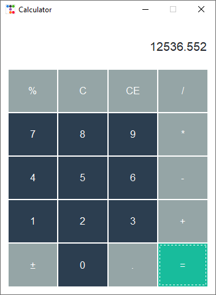

# Calculator
This basic calculator UI demonstrates how to use different colors to 
differentiate button functions. 

The theme used in this example is **flatly**.



## Style Summary

| Item      | Class     | Bootstyle |
| ---       | ---       |---        |
| Digits    | `Button`  | primary   |
| Operators | `Button`  | secondary |
| Equals    | `Button`  | success   |

## Example Code

[Run this code live]() on repl.it

```python
import tkinter as tk
import ttkbootstrap as ttk

class Application(tk.Tk):

    def __init__(self):
        super().__init__()
        self.title('Calculator')
        self.style = ttk.Style('flatly')
        self.style.configure('.', font='TkFixedFont 16')
        self.calc = Calculator(self)
        self.calc.pack(fill=tk.BOTH, expand=tk.YES)


class Calculator(ttk.Frame):

    def __init__(self, *args, **kwargs):
        super().__init__(*args, **kwargs)
        self.configure(padding=3)

        # number display
        self.display_var = tk.StringVar(value=0)
        self.display = ttk.Label(
            master=self, 
            textvariable=self.display_var,
            font='TkFixedFont 20', 
            anchor=tk.E
        )
        self.display.grid(
            row=0, 
            column=0, 
            columnspan=4, 
            sticky=tk.EW,
            pady=15, 
            padx=10
        )

        # button layout
        button_matrix = [
            ('%', 'C', 'CE', '/'),
            (7, 8, 9, '*'),
            (4, 5, 6, '-'),
            (1, 2, 3, '+'),
            ('±', 0, '.', '=')]

        # create buttons with various styling
        for i, row in enumerate(button_matrix):
            for j, lbl in enumerate(row):
                if isinstance(lbl, int):
                    btn = ttk.Button(
                        master=self, 
                        text=lbl, 
                        width=2,
                        bootstyle='primary'
                    )
                elif lbl == '=':
                    btn = ttk.Button(
                        master=self, 
                        text=lbl, 
                        width=2,
                        bootstyle='success'
                    )
                else:
                    btn = ttk.Button(
                        master=self, 
                        text=lbl, 
                        width=2,
                        bootstyle='secondary'
                    )
                btn.grid(
                    row=i + 1, 
                    column=j, 
                    sticky=tk.NSEW, 
                    padx=1, 
                    pady=1,
                    ipadx=10, 
                    ipady=10
                )

                # bind button press
                btn.bind("<Button-1>", self.press_button)

        # variables used for collecting button input
        self.position_left = ''
        self.position_right = '0'
        self.position_is_left = True
        self.running_total = 0.0

    def press_button(self, event):
        value = event.widget['text']

        if isinstance(value, int):
            if self.position_is_left:
                self.position_left = f'{self.position_left}{value}'
            else:
                if self.position_right == '0':
                    self.position_right = str(value)
                else:
                    self.position_right = f'{self.position_right}{value}'
        elif value == '.':
            self.position_is_left = False
        elif value in ['/', '-', '+', '*']:
            self.operator = value
            self.running_total = float(self.display_var.get())
            self.reset_variables()
        elif value == '=':
            operation = ''.join(
                map(
                    str,
                    [
                        self.running_total, 
                        self.operator, 
                        self.display_var.get()
                    ]
                )
            )
            result = eval(operation)
            self.display_var.set(result)
            return

        elif value in ['CE', 'C']:
            self.reset_variables()
            self.operator = None
            self.running_total = 0
            return

        # update the number display
        self.display_var.set('.'.join(
            [self.position_left, self.position_right]))

    def reset_variables(self):
        self.display_var.set(0)
        self.position_is_left = True
        self.position_left = ''
        self.position_right = '0'


if __name__ == '__main__':
    
    Application().mainloop()
```