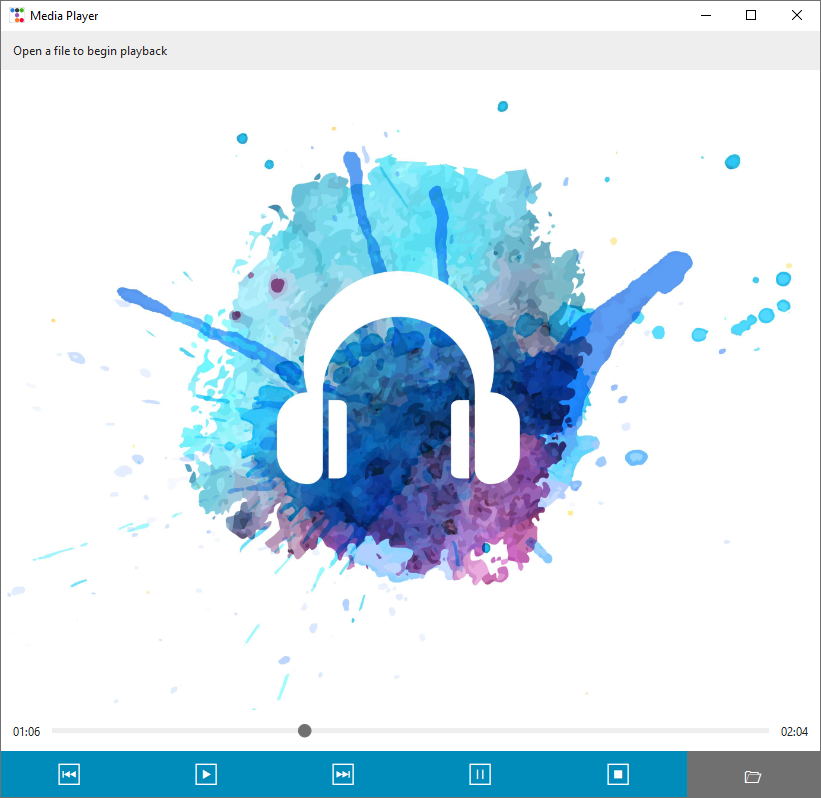

# Media Player

This example demonstrates how to build a media player GUI. The buttons are 
simple unicode characters. 

The theme used in this example is **minty**.



## Style Summary

| Item                  | Class     | Bootstyle |
| ---                   | ---       | --- |
| Header                | `Label`   | light-inverse |
| Media Controls        | `Button`  | primary |
| File Open             | `Button`  | secondary |
| Time Elapsed Slider   | `Scale`   | info |

## Example Code

[Run this code live]() on repl.it

```python
from pathlib import Path
import tkinter as tk
import ttkbootstrap as ttk


class Application(tk.Tk):

    def __init__(self):
        super().__init__()
        self.title('Media Player')

        self.style = ttk.Style()
        self.style.theme_use('minty')

        self.player = Player(self)
        self.player.pack(fill=tk.BOTH, expand=tk.YES)

class Player(ttk.Frame):
    """An interface for a media player"""

    def __init__(self, *args, **kwargs):
        super().__init__(*args, **kwargs)
        self.configure(padding=1)
        _path = Path(__file__).parent / 'assets'
        self.background = tk.PhotoImage(file=_path / 'mp_background.png')
        self.controls = {
            'skip-previous': '\u23EE',
            'play': '\u23F5',
            'pause': '\u23F8',
            'stop': '\u23F9',
            'skip-next': '\u23ED',
            'open-file': '\U0001f4c2'}

        # track information header
        self.track_info = tk.StringVar(value='Open a file to begin playback')
        header = ttk.Label(
            master=self,
            textvariable=self.track_info,
            font='-size 12',
            bootstyle='light-inverse',
            padding=(5, 10)
        )
        header.pack(fill=tk.X, padx=2)

        # media container
        self.container = ttk.Label(self, image=self.background)
        self.container.pack(fill=tk.BOTH, expand=tk.YES)

        # progress bar
        progress_frame = ttk.Frame(self, padding=10)
        progress_frame.pack(fill=tk.X, expand=tk.YES)

        self.time_elapsed = ttk.Label(
            master=progress_frame,
            text='00:00',
            font='-size 12'
        )
        self.time_elapsed.pack(side=tk.LEFT)

        self.time_scale = ttk.Scale(
            master=progress_frame,
            orient=tk.HORIZONTAL,
            bootstyle='info'
        )
        self.time_scale.pack(side=tk.LEFT, fill=tk.X, expand=tk.YES, padx=10)

        self.time_remaining = ttk.Label(
            master=progress_frame,
            text='00:00',
            font='-size 12'
        )
        self.time_remaining.pack(side=tk.RIGHT)

        # button controls
        control_frame = ttk.Frame(self)
        control_frame.pack(fill=tk.X, expand=tk.YES)

        self.buttons = {
            'play': ttk.Button(
                master=control_frame,
                text=self.controls['play']),
            'skip-previous': ttk.Button(
                master=control_frame,
                text=self.controls['skip-previous']),
            'skip-next': ttk.Button(
                master=control_frame,
                text=self.controls['skip-next']),
            'pause': ttk.Button(
                master=control_frame,
                text=self.controls['pause']),
            'stop': ttk.Button(
                master=control_frame,
                text=self.controls['stop']),
            'open-file': ttk.Button(
                master=control_frame,
                text=self.controls['open-file'],
                bootstyle='secondary')
        }

        for button in [
            'skip-previous', 'play', 'skip-next',
            'pause', 'stop', 'open-file'
        ]:
            self.buttons[button].pack(
                side=tk.LEFT,
                fill=tk.X,
                expand=tk.YES,
                ipadx=5,
                ipady=5,
                padx=2,
                pady=2
            )


if __name__ == '__main__':
    Application().mainloop()
```