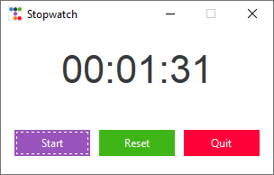

# Stopwatch Widget

This stopwatch widget allows the user to start, stop, and reset. Different 
styles are applied to the **Start** and **Pause** button depending on the 
state of the button. 

The theme applied is **cosmo**.

  

  


## Style Summary

| Item      | Class     | Bootstyle |
| ---       | ---       | --- |
| Start     | `Button`  | info |
| Pause     | `Button`  | info-outline |
| Reset     | `Button`  | success |
| Exit      | `Button`  | danger |

## Example Code

[Run this code live]() on repl.it

```python
import tkinter as tk
import ttkbootstrap as ttk


class Application(tk.Tk):

    def __init__(self):
        super().__init__()
        self.title('Stopwatch')
        self.style = ttk.Style("cosmo")
        self.timer = TimerWidget(self)
        self.timer.pack(fill=tk.BOTH, expand=tk.YES)


class TimerWidget(ttk.Frame):

    def __init__(self, *args, **kwargs):
        super().__init__(*args, **kwargs)

        # variables
        self.running = tk.BooleanVar(value=False)
        self.after_id = tk.StringVar()
        self.time_elapsed = tk.IntVar()
        self.time_text = tk.StringVar(value='00:00:00')

        # timer label
        self.timer_lbl = ttk.Label(
            master=self,
            font='-size 32',
            anchor=tk.CENTER,
            textvariable=self.time_text
        )
        self.timer_lbl.pack(
            side=tk.TOP,
            fill=tk.X,
            padx=60,
            pady=20
        )
        # control buttons
        self.toggle_btn = ttk.Button(
            master=self,
            text='Start',
            width=10,
            bootstyle='info',
            command=self.toggle
        )
        self.toggle_btn.pack(
            side=tk.LEFT,
            fill=tk.X,
            expand=tk.YES,
            padx=10,
            pady=10
        )
        self.reset_btn = ttk.Button(
            master=self,
            text='Reset',
            width=10,
            bootstyle='success',
            command=self.reset
        )
        self.reset_btn.pack(
            side=tk.LEFT,
            fill=tk.X,
            expand=tk.YES,
            pady=10
        )
        self.quit_btn = ttk.Button(
            master=self,
            text='Quit',
            width=10,
            bootstyle='danger',
            command=self.quit
        )
        self.quit_btn.pack(
            side=tk.LEFT,
            fill=tk.X,
            expand=tk.YES,
            padx=10,
            pady=10
        )

    def toggle(self):
        if self.running.get():
            self.pause()
            self.running.set(False)
            self.toggle_btn.configure(text='Start', bootstyle='info')
        else:
            self.start()
            self.running.set(True)
            self.toggle_btn.configure(
                text='Pause',
                bootstyle=('info', 'outline')
            )

    def pause(self):
        self.after_cancel(self.after_id.get())

    def start(self):
        self.after_id.set(self.after(1, self.increment))

    def increment(self):
        current = self.time_elapsed.get() + 1
        self.time_elapsed.set(current)
        time_str = '{:02d}:{:02d}:{:02d}'.format(
            (current // 100) // 60,
            (current // 100) % 60,
            current % 100
        )
        self.time_text.set(time_str)
        self.after_id.set(self.after(100, self.increment))

    def reset(self):
        self.time_elapsed.set(0)
        self.time_text.set('00:00:00')


if __name__ == '__main__':
    Application().mainloop()
```