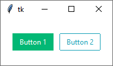

# Tutorial

## Creating an application
If you've used **tkinter** and **ttk**, the following example will look familiar. 
I'll explain a few of the differences.

- import `ttkbootstrap` instead of `ttk`
- use the `bootstyle` parameter to add keywords instead of `style`

```python
import tkinter as tk
import ttkbootstrap as ttk

root = tk.Tk()
style = ttk.Style()

b1 = ttk.Button(root, text="Button 1", bootstyle="success")
b1.pack(side=tk.LEFT, padx=5, pady=10)

b2 = ttk.Button(root, text="Button 2", bootstyle="info-outline")
b2.pack(side=tk.LEFT, padx=5, pady=10)

root.mainloop()
```

The code above will produce this window with two buttons.



## Choosing a theme

The default theme is **litera**, but you can start the application with any of 
the [built-in themes](../themes/index.md) by passing in the theme name when you create 
the style object.

```python
>>> style = Style("darkly")
```

## Use themed widgets

ttkbootstrap widgets have [dozens of predefined styles](../styleguide/index.md) which are 
applied using **keywords** that modify both the **type** and **color** of the 
widget. The actual color values are defined for each theme.

For example, using the keyword **outline** would draw a button with an outline 
_type_, but using the keyword **info** would change the _color_ of the outline
and text.

### Style Colors
The example below shows a button for every color.

```python
import tkinter as tk
import ttkbootstrap as ttk

root = tk.Tk()
style = ttk.Style()

b1 = ttk.Button(root, text='primary', bootstyle='primary')
b1.pack(side=tk.LEFT, padx=5, pady=5)

b2 = ttk.Button(root, text='secondary', bootstyle='secondary')
b2.pack(side=tk.LEFT, padx=5, pady=5)

b3 = ttk.Button(root, text='success', bootstyle='success')
b3.pack(side=tk.LEFT, padx=5, pady=5)

b4 = ttk.Button(root, text='info', bootstyle='info')
b4.pack(side=tk.LEFT, padx=5, pady=5)

b5 = ttk.Button(root, text='warning', bootstyle='warning')
b5.pack(side=tk.LEFT, padx=5, pady=5)

b6 = ttk.Button(root, text='danger', bootstyle='danger')
b6.pack(side=tk.LEFT, padx=5, pady=5)

b7 = ttk.Button(root, text='light', bootstyle='light')
b7.pack(side=tk.LEFT, padx=5, pady=5)

b8 = ttk.Button(root, text='dark', bootstyle='dark')
b8.pack(side=tk.LEFT, padx=5, pady=5)

root.mainloop()
```


I could have created those buttons in a simpler fashion by using the 
`Style.colors` object, which contains a reference to all colors used in the 
theme, and which is also an _iterator_.

```python
for color in style.colors:
    b = ttk.Button(root, text=color, bootstyle=color)
    b.pack(side=tk.LEFT, padx=5, pady=5)
```

### Style Types

The **keyword** can control the **type** of widget that is presented. Consider 
the following example, which shows a **solid** and an **outline** button. They
are both buttons, but of different **types**.

```python
import tkinter as tk
import ttkbootstrap as ttk

root = tk.Tk()
style = ttk.Style()

b1 = ttk.Button(root, text="Solid Button", bootstyle="success")
b1.pack(side=tk.LEFT, padx=5, pady=10)

b2 = ttk.Button(root, text="Outline Button", bootstyle="success-outline")
b2.pack(side=tk.LEFT, padx=5, pady=10)

root.mainloop()
```
As you can see, by adding the **outline** keyword, the button has been
transformed from a **solid** to an **outline** button type.


### Keyword usage

On final note on using keywords... the **bootstyle** parameter is VERY flexible. 
It doesn't really matter how the keyword looks. There is a regex expression in 
the background that parses the input and converts it into the appropriate ttk 
style.

All of the following variations are legal and will result in the same style.

* `"info-outline"`
* `"infooutline"`
* `"info outline"`
* `"outline-info"`
* `("info", "outline")`

!!! note "The recommended keyword separator is a dash"
    While you can use any convention that you want as long as it works, it is
    recommended to separate the keywords using a dash when possible. Otherwise,
    it may sometimes be necessary or more convenient to use a `list` or `tuple`.